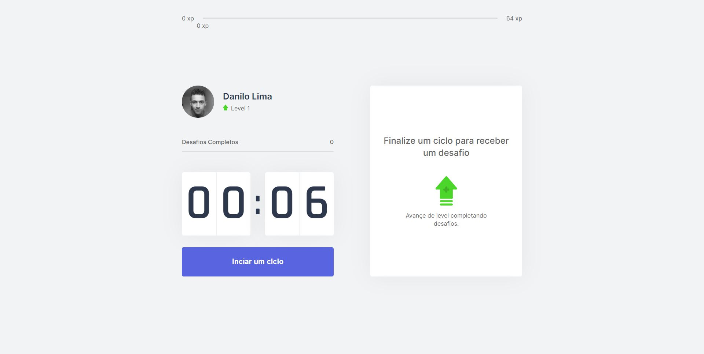

<h1 align="center">
    
</h1>

 

  

 

## Projeto

**Moveit** - App de bem estar focado em ergonomia através de gamificação.

## Tecnologias

Esse projeto foi desenvolvido com as seguintes tecnologias:

- [ReactJS](https://reactjs.org)
- [NextJS](https://nextjs.org/)

## Como rodar este projeto?

 

### Antes de rodar o projeto

 

Como pré-requisito para rodar o projeto você precisa ter instalado na sua máquina o [Git](https://git-scm.com), o [Node.js](https://nodejs.org/en/) e um editor de texto da sua preferência (sugiro bastante o [VS_Code](https://code.visualstudio.com/)) :D

 

## Clonando o projeto

Para começar primeiro clone este projeto, se preferir você também pode baixá-lo como um arquivo .zip acessando esse link [Moveit](https://github.com/DaniloLima122/moveit)

~~~shell
# Clone este repositório
$ git clone https://github.com/DaniloLima122/moveit.git

# Acesse a pasta do projeto pelo seu terminal/cmd
$ cd moveit
~~~

### Rodando o projeto

~~~shell
# Acesse a pasta "moveit":
$ cd moveit

# Instale as dependências:
$ npm install

# Se você usa o Yarn digite:
$ yarn install

# Agora rode aplicação em modo de desenvolvimento:
$ npm run dev

# Ou se você usa o Yarn, digite:
$ yarn dev

~~~

O projeto será aberto na porta:3000 - acesse http://localhost:3000 no navegador.

## Como contribuir?

Este projeto ainda pode ser melhorado e para contribuir é simples, siga os seguintes passos:

- Faça um fork desse repositório;
- Crie uma branch com a sua feature: `git checkout -b nova-feature`;
- Faça commit das suas alterações: `git commit -m 'my-feature'`;
- Faça push para a sua branch: `git push origin nova-feature`.

Depois que o merge da sua pull request ser concluido, você pode deletar a branch da sua feature.

## Licença

Esse projeto está sob a licença MIT. Veja o arquivo [LICENSE](https://github.com/DaniloLima122/Proffy/blob/master/LICENSE).

## Meus Agradecimentos

- [Equipe RocketSeat](https://rocketseat.com.br/)
- [Diego Fernandes, CTO da Rocketseat](https://github.com/diego3g)

Made with ♥ by Danilo Lima

